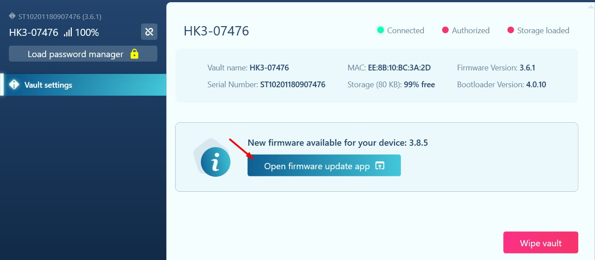
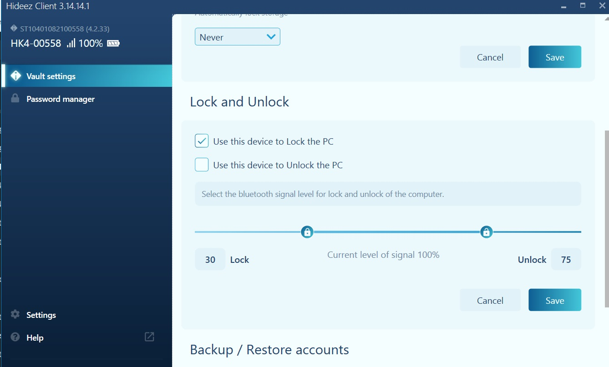
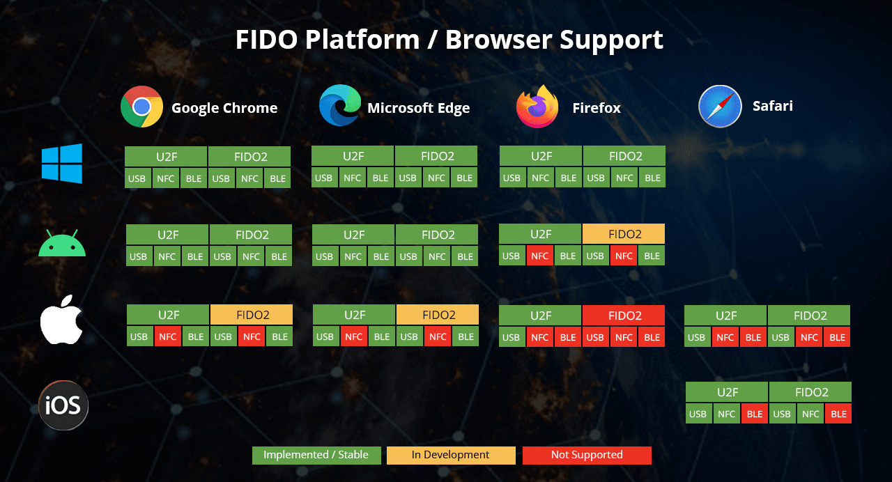

# Quickstart Guide


**Please note!** The password manager, password generator and smart lock functionality only works on Windows 10 and Windows 11 computers with the Hideez Client app installed.


### Step 1: Remove the insulating material from the case of the device

Open up the [Hideez Key's case](interface/service-operations/battery-maintenance.md) and remove the white plastic stripe.

.png>).png>)

### Step 2: Install the Hideez Client application

You can download the latest version of the Hideez Client [here](https://update.hideez.com/update/hideezclient/clientsetup.exe). &#x20;

<figure><figcaption></figcaption></figure>

Run the **clientsetup.exe** file, select the **Standalone version** and check the **Use external Bluetooth Dongle** box. In addition, you can choose the language required. Choose desired options and click the "Apply" button.

<figure><figcaption></figcaption></figure>

If you selected the wrong options during installation, you can change them later in the ["Configuration" utility](configuration-app.md).

### Step 3: Pair the Hideez Key with the Hideez Client

Plug the Hideez Bluetooth adapter into a USB port. Avoid using a USB hub, if possible. The "**Hideez Bluetooth Dongle**" indicator in the lower left corner of the Hideez Client will turn green.

 (1) (1).png>)


It's also possible to utilize Hideez Key 3 via internal Bluetooth (BLE) on your computer. This option becomes available after updating the firmware via the Dongle. To enable this, you need to change the connection type of your Hideez Client to "Windows Internal Bluetooth" using the[ **Configuration app**](configuration-app.md) and[ **pair your Key with your computer**](../passwordless-fido-authentication-and-2fa/pairing-hideez-key-with-windows-10.md).


#### To pair your Hideez Key with the Hideez Client, you will need to:

1. Launch the Hideez Client application.
2. Press the Hideez Key's button to activate the device. You will see a flashing blue light.
3. Bring your Hideez Key close to the Bluetooth adapter. You need to touch the dongle with the Hideez Key for 1-2 seconds and confirm pairing by pressing the Hideez Key's button when it will flash green.
4. Set up your master password (minimum 8 characters - letters, numbers, and special symbols). You can change your master password later on, but be sure to remember it.


**Please note!** It will be impossible to recover a forgotten master password! If you don't have a master password, you can only [wipe all the data which is stored in your Key.](https://key3-4-bundle-en.hideez.com/use-on-windows-with-a-dongle/interface/service-operations/wipe)




### Step 5: Update the firmware of your device

Once the Hideez Key is paired with your PC and authorized in the Hideez Client, you will be able to update the device firmware to the latest available version. Open the **Firmware update app** and follow the on-screen instructions.

<figure><figcaption></figcaption></figure>

Check the "**Hideez Dongle"** option and click on the "**Quick update"** button. Keep the Hideez Key close to the dongle and wait until the firmware is fully updated.



### Step 6: Access the Password Manager

After updating the firmware, click the "**Load password manager**" button in the upper left corner to access the **Password Manager.** You will be required to enter the master password you created during the initial setup.

<figure><figcaption></figcaption></figure>

### Step 7: Manage your Passwords and 2FA

Go to the **Password Manager** tab and click the "+" icon to add a new account.&#x20;

You can also use the keyboard shortcut **Ctrl + Alt + A** to open a popup window and add your account information directly from any website. In this case, the account name and app/site fields will be pre-populated and can be edited manually.

When adding new accounts, you can change the account name, website address, generate a new password, and enable one-time password generation for those sites where you have 2FA enabled.

You can also [import](vault-settings/untitled-1-1.md#importing-your-data-to-the-hideez-client) or [export ](vault-settings/untitled-1-1.md#backups-and-exporting-your-data-from-the-hideez-client)your credentials in CSV format.


**Once you have added multiple accounts, you will be able to use two login methods:**\
\
**1) Pressing the button on the Hideez Key**\
a) 2 clicks = login autofill\
b) 3 clicks = password autofill\
c) 4 clicks = OTP autofill

**2) Using keyboard shortcuts**\
a) Ctrl+Alt+L = login autofill\
b) Ctrl+Alt+P = password autofill\
c) Crtl+Alt+O = OTP autofill




**LEARN MORE**:\
How to [make backups](vault-settings/untitled-1-1.md#how-to-create-a-backup) and [restore your data](vault-settings/untitled-1-1.md#recovering-credentials-from-a-backup)\
How to [add](account-management/create-an-account-for-sites-and-applications.md#adding-new-accounts-to-the-hideez-client), [edit ](account-management/edit-an-existing-account.md)or [delete](account-management/delete-an-existing-account.md) accounts manually\
How to [password-protect local applications](account-management/create-an-account-for-sites-and-applications.md#adding-password-protection-for-local-applications)\
How to [generate one-time passwords](account-management/create-an-account-for-sites-and-applications.md#enabling-otp-input-for-your-accounts) for 2FA\
How to [change keyboard shortcuts](interface/general-settings/configuring-hotkeys.md) for entering login credentials

### Step 8: Set up proximity-based desktop logon and logoff 

### Desktop Logoff

To automatically lock your computer when you step away from it, check the **"Use this device to lock the PC"** box in the Vault settings. You can adjust the distance you need with a slider. Your desktop will be locked when the Bluetooth signal level falls below the specified value in % and unlocked when the Bluetooth signal level exceeds the specified value in %.


We recommend setting intervals between values to at least 40. Optimal values are 30% for desktop logout and 70% for desktop login.


<figure><figcaption></figcaption></figure>

### Desktop Logon

If you want to use Hideez Key to unlock your desktop on the basis of proximity, check the **Use this device to Unlock the PC** checkbox in the **Vault settings** section.&#x20;

1\) You will need to add your **Primary account.** Enter the password for the account associated with your PC (e.g. Local user account, Domain user account, Azure AD, Microsoft account) to activate PC logon.

2\) You will have a choice between three methods to unlock your computer:

* [Automatic unlock](vault-settings/configure-the-methods-of-locking-and-unlocking-the-pc-proximity-settings.md#automatic-unlock) - the computer is unlocked automatically as soon as the distance threshold reaches the specified value.
* [Wait for user activity](vault-settings/configure-the-methods-of-locking-and-unlocking-the-pc-proximity-settings.md#wait-for-user-activity) - the computer is unlocked as soon as the distance threshold reaches the specified value and the user performs any preferred action (clicks the mouse / presses any key on keyboard)
* [Tap\&Go](vault-settings/configure-the-methods-of-locking-and-unlocking-the-pc-proximity-settings.md#tap-and-go) - the computer is unlocked automatically as soon as the user touches the dongle with the Hideez key.



**LEARN MORE:**\
How to [add a Primary account](vault-settings/create-and-manage-an-account-to-unlock-your-pc.md) to unlock your PC\
How to [set up locking / unlocking methods](vault-settings/configure-the-methods-of-locking-and-unlocking-the-pc-proximity-settings.md)\
How to [hide unlock option if you don't use it](interface/general-settings/logon.md)

### Step 9: Enable Passwordless sign-in across FIDO2 & FIDO U2F websites 

Hideez Key supports passwordless authentication standards ([FIDO U2F and FIDO2](https://fidoalliance.org/specifications/)) developed by the FIDO Alliance. FIDO specifications are currently supported by over 300 popular websites and applications in Google [Chrome](https://blog.chromium.org/2018/09/chrome-70-beta-shape-detection-web.html), Mozilla [Firefox](https://blog.mozilla.org/blog/2018/05/09/firefox-gets-down-to-business-and-its-personal/), Microsoft [Edge](https://blogs.windows.com/msedgedev/2018/07/30/introducing-web-authentication-microsoft-edge/) and Apple [Safari](https://webkit.org/blog/8517/release-notes-for-safari-technology-preview-71/) web browsers.

In order to use Hideez Key as a FIDO2/U2F security key, you will have have to pair it with your endpoint devices. The supported devices include:

* Computers running Windows 10 or Windows 11;
* Android devices (version 7.0 and later);
* iOS devices (version 13.3 and later) devices.

<figure><figcaption></figcaption></figure>

Instructions for setting up passwordless login can be found on sites that support FIDO2 and FIDO U2F specifications (e.g. Google, Microsoft, Facebook, Twitter, Dropbox, and other platforms). You can review the full list of sites supporting FIDO2 and FIDO U2F standards [here.](https://hideez.com/pages/supported-services)

<figure><figcaption></figcaption></figure>


**Please note:** You will need to enable the passwordless sign-in method with a security key for each app and website you want to use it with.


Typically, a physical security key is added as an extra login method in your account's **Security settings**. Here is a short video guide with an example of setting up a passwordless login to Google account:



**LEARN MORE:**

How to enable [passwordless sign-in and 2FA](../passwordless-fido-authentication-and-2fa/setting-up-passwordless-logins-and-2fa.md) with the Hideez Key \
How to pair the Hideez Key with [Windows](../passwordless-fido-authentication-and-2fa/pairing-hideez-key-with-windows-10.md) and [Android ](../passwordless-fido-authentication-and-2fa/using-hideez-key-with-android-devices.md)devices\
How to pair the Hideez Key with [iOS](../passwordless-fido-authentication-and-2fa/pairing-hideez-key-with-macos-ios-devices.md) devices

### Step 10: Physical Access (optional) 

You can use Hideez Key as an RFID keycard. The device contains an RFID module that can be programmed to open an electronic door in your house, office, or gym.&#x20;

You may ask **authorized locksmith service** to clone your exiting key fob on Hideez Key.


Learn more: [How to use Hideez Key as an RFID card](https://hideez.gitbook.io/hideez-key-3-4-bundle-en/rfid-card/use-hideez-key-as-an-rfid-card)


### Additional Info 

How to [change your master password](vault-settings/change-master-password.md)\
How to [change access settings](vault-settings/untitled-1.md) in the Hideez Client\
How to [wipe the device](interface/service-operations/wipe.md)\
How to [update the firmare](interface/service-operations/upgrade-firmware.md) of the Hideez Key\
How to [update the Hideez Client](../upgrading/untitled.md)

### Any Questions?  

We offer online help to assist customers with their inquiries. \
Please write at [support@hideez.com ](mailto:support@hideez.com)to get in touch our support team member.
