# Pairing Hideez Key with Windows


It's also possible to utilize Hideez Key 3 via internal Bluetooth (BLE) on your computer. This option becomes available after updating the firmware via the Dongle. To enable this, you need to change the connection type of your Hideez Client using the [Configuration app](../guide-for-hideez-key-bundle-with-bt-adapter/configuration-app.md)**.**


Hideez Key devices support passwordless authentication stadards developed by the FIDO Alliance: [FIDO U2F and FIDO2](https://fidoalliance.org/specifications/). You can pair Hideez Key with any devices supporting FIDO Security Keys, including computers running Windows 10/11, Android (version 7.0+) or iOS (version 13.3+) devices.

Services that support these standards include Google, Facebook, Twitter, and Dropbox, and [other](https://hideez.com/pages/supported-services).


For successful pairing of the Hideez Key, you will need a Windows 10, OS build 1840, or later. For earlier versions, the correct operation of the device is not guaranteed. \
[How to find out which version of Windows your device is running.](https://support.microsoft.com/en-us/help/13443/windows-which-version-am-i-running)


You can pair [Hideez Key 3](https://hideez.com/products/hideez-key-3) and [Hideez Key 4](https://hideez.com/products/hideez-key-4) devices to your Windows PC with the following steps:

### **Pairing FIDO security keys with Windows 10‌**

1. Select **Start** > **Settings** > **Devices** > **Bluetooth & other devices**.\
   &#x20;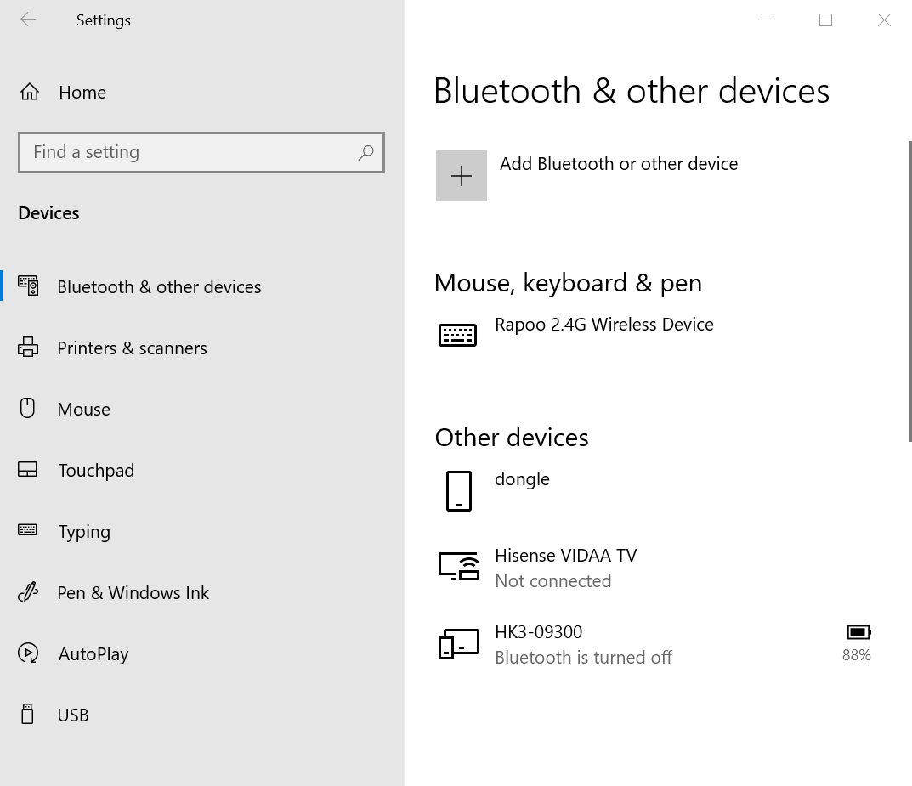&#x20;
2.  Press (short press) the button on the Hideez Key device.\
    &#x20;&#x20;

    After you press a device button, a blue LED lights up - three long flashes of variable brightness, which means that the device is ready for Pairing.\

3. Click **Add Bluetooth or other devices > Bluetooth** on the Windows screen.\
   &#x20; 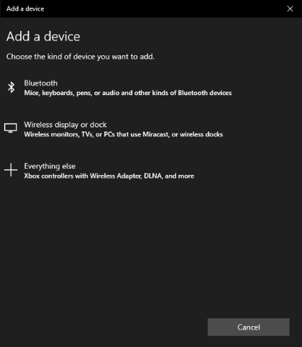&#x20;
4. Select your Hideez Key device (for example HK-00203). The last five digits coincide with the serial number printed on the device box.\
   &#x20;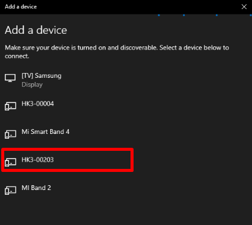&#x20;
5. After the connection is established, the green LED lights up (blinks) on the selected device, inviting you to confirm the operation. You need to confirm pairing with a short button press. \
   If you don’t confirm the operation within 15 seconds, there will be no pairing and the LED on the device will stop blinking. \
   &#x20;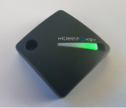 \
   [Video](https://youtu.be/iBaGqvRmLmA)
6.  Successful pairing is confirmed by the inscription «Your device is ready to go».

    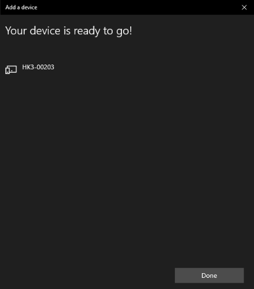&#x20;
7. In the Bluetooth & other devices section, a new HK4-00203 device appears.\
   &#x20;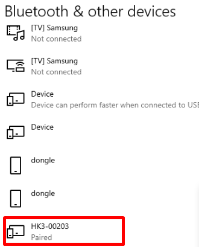&#x20;

### **Creating a PIN code on a Hideez Key device**


The PIN code created for Secure Device for Windows (FIDO) may differ from the PIN code in Hideez Client.


Windows uses another technology to securely store, transfer, and verify the PIN code.

1. Select **Start** > **Windows Settings** > **Account** > **Sign-in options** > **Security Key** > **Manage**
2. After clicking on the **Manage** button, the Hideez Key will require confirmation of this operation with a short press on the button. If you don’t confirm it in 20 seconds, Windows reports the problem and restarts the operation. \
   &#x20;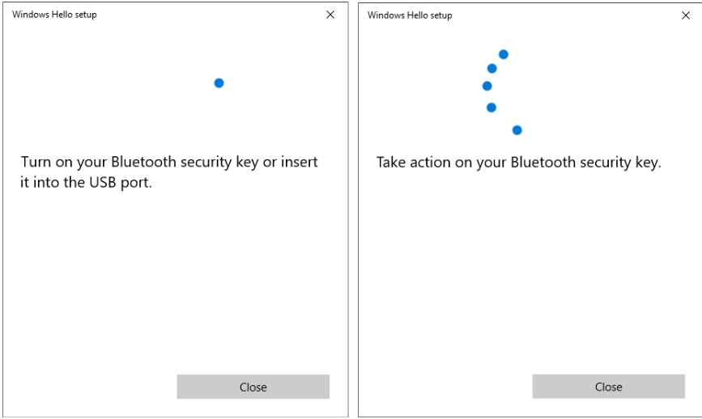 \
   [Video](https://youtu.be/baczWo7j73M)
3. A "Windows Hello setup" window appears with the menu "Add Security Key PIN" and "Reset Security Key". \
   &#x20;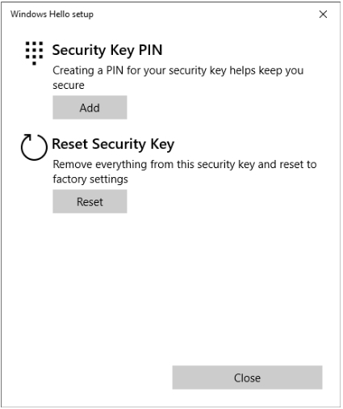 \
   [Video](https://youtu.be/baczWo7j73M)
4. Select “Add PIN to Security Key” and enter the same PIN code containing 4 to 32 digits twice.\
   &#x20;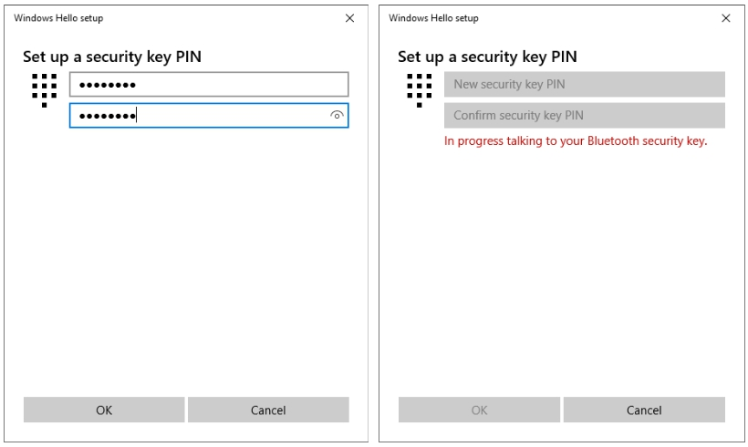&#x20;

### **‌Changing PIN code for FIDO technology**

Go to the “Windows Hello setup” section and select “Change Security Key PIN” to change the PIN code. Next, you need to type your old PIN followed by a new one (twice) and click “OK”.\
&#x20;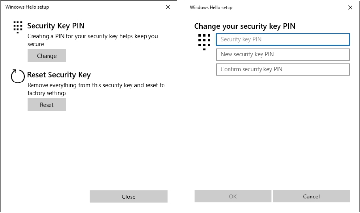&#x20;

### **Removing PIN code and clearing all FIDO data**

1. Enter the “Windows Hello setup” section and select “Reset Security Key” and then “Proceed” to remove the PIN code and FIDO data. \
   &#x20;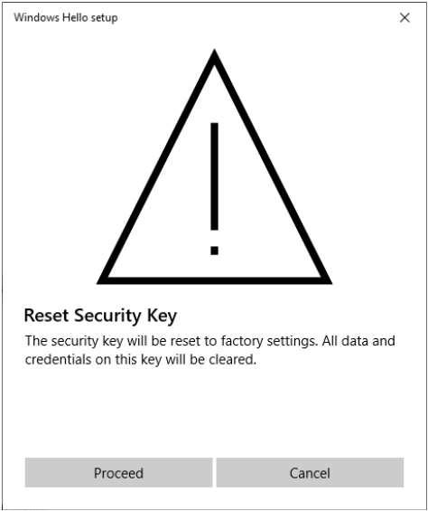&#x20;
2. Each time the message “Take action on your Bluetooth security key” appears, confirm it with a short press. This action must be confirmed twice.\
   &#x20;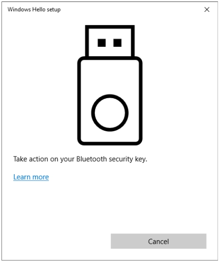 \
   [Video](https://youtu.be/baczWo7j73M)
3. The success of the operation is signaled by the message “Reset Complete”. After that, all data associated with FIDO (PIN, accounts) will be removed.\
   &#x20;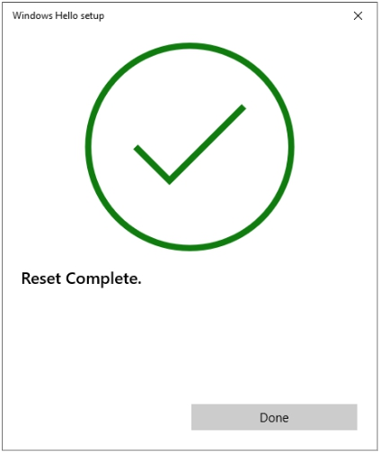&#x20;

After the Hideez Key has been successfully paired with your computer, you can proceed to [setting up a passwordless login](setting-up-passwordless-logins-and-2fa.md) to the desired accounts.


After pairing you can also set up the [proximity lock](broken-reference) and [unlock](broken-reference) options (without the dongle).

