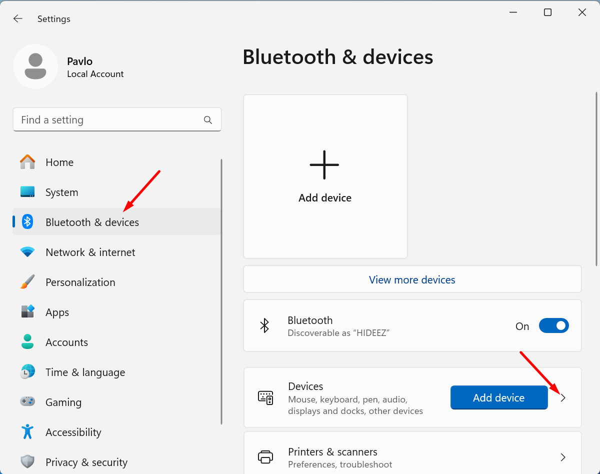
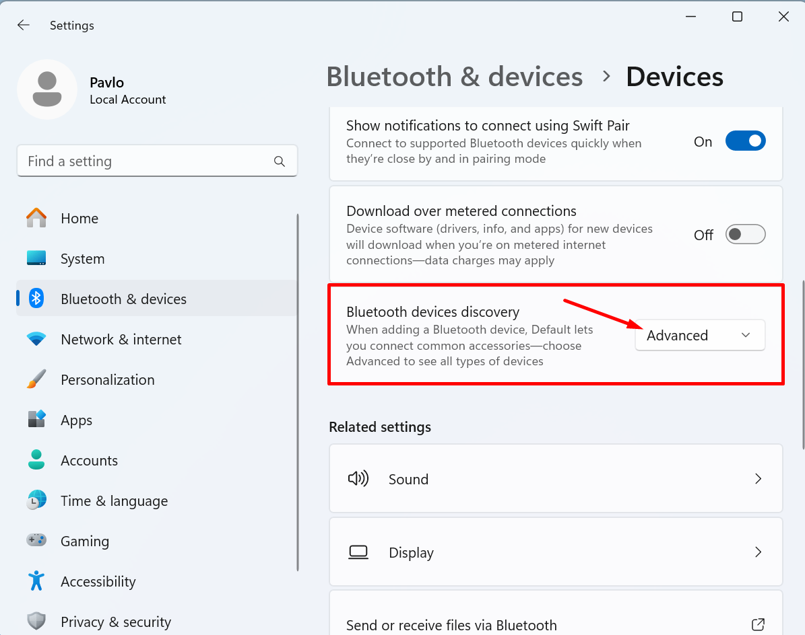

# Troubleshooting

#### Windows 11 can not recognize the Hideez Key in the device lists

_After installing the “2023-06 Cumulative Update for Windows 11 Version 22H2 for x64-based Systems (KB5027231)” update, users may encounter difficulties in discovering or pairing Bluetooth devices, including **Hideez Key** and other Bluetooth peripherals. Even devices that are turned on and ready to pair may not appear as available options when attempting to add a Bluetooth device through the Windows system._

To resolve this:

1. Open **Start** **→** **Settings →** **Bluetooth & devices.** &#x20;
2. Then click on the section **Devices:**

<figure><figcaption></figcaption></figure>

3. Scroll down to the section **Bluetooth devices discovery** and select the option **Advanced:**

<figure><figcaption></figcaption></figure>

Now, you should be able to add the Hideez Key to your Windows 11 computer.


If you have any further questions or require additional assistance, don't hesitate to reach out. If you need support, please [contact us](https://hideez.com/pages/contact-hideez-support), and our agent will respond to you via email within 24 hours. Your satisfaction is important to us, and we're here to help!


